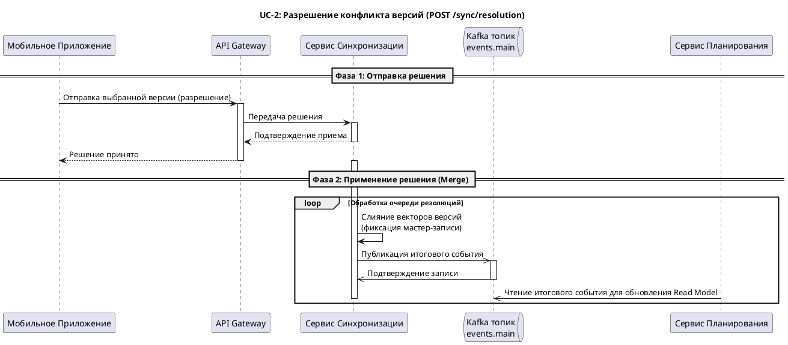

```plantuml
@startuml
title UC-2: Разрешение конфликта версий (POST /sync/resolution)

participant "Мобильное Приложение" as App
participant "API Gateway" as GW
participant "Сервис Синхронизации" as Sync
queue "Kafka топик\nevents.main" as K_main
participant "Сервис Планирования" as Trip

== Фаза 1: Отправка решения ==
App -> GW: Отправка выбранной версии (разрешение)
activate GW
GW -> Sync: Передача решения
activate Sync
Sync --> GW: Подтверждение приема
deactivate Sync
GW --> App: Решение принято
deactivate GW

== Фаза 2: Применение решения (Merge) ==
loop Обработка очереди резолюций
    activate Sync
    Sync -> Sync: Слияние векторов версий\n(фиксация мастер-записи)
    
    Sync ->> K_main: Публикация итогового события
    activate K_main
    Sync <<- K_main: Подтверждение записи
    deactivate K_main
    
    Trip ->> K_main: Чтение итогового события для обновления Read Model
    deactivate Sync
end
@enduml
```
