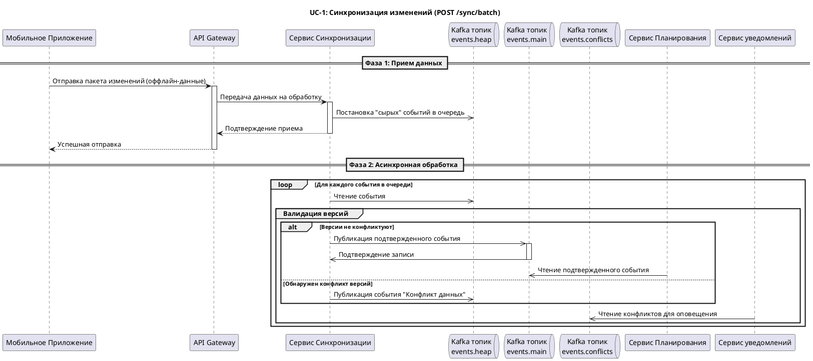

```plantuml
@startuml
title UC-1: Синхронизация изменений (POST /sync/batch)

participant "Мобильное Приложение" as App
participant "API Gateway" as GW
participant "Сервис Синхронизации" as Sync
queue "Kafka топик\nevents.heap" as K_heap
queue "Kafka топик\nevents.main" as K_main
queue "Kafka топик\nevents.conflicts" as K_conflicts
participant "Сервис Планирования" as Trip
participant "Сервис уведомлений" as Push

== Фаза 1: Прием данных ==
App -> GW: Отправка пакета изменений (оффлайн-данные)
activate GW
GW -> Sync: Передача данных на обработку
activate Sync

Sync ->> K_heap: Постановка "сырых" событий в очередь

Sync --> GW: Подтверждение приема
deactivate Sync
GW --> App: Успешная отправка
deactivate GW

== Фаза 2: Асинхронная обработка ==
loop Для каждого события в очереди
    Sync ->> K_heap: Чтение события
    
    group Валидация версий
        alt Версии не конфликтуют
            Sync ->> K_main: Публикация подтвержденного события
            activate K_main
            Sync <<- K_main: Подтверждение записи
            deactivate K_main

                Trip ->> K_main: Чтение подтвержденного события
            deactivate K_heap

        else Обнаружен конфликт версий
            Sync ->> K_heap: Публикация события "Конфликт данных"
        end
        Push ->> K_conflicts: Чтение конфликтов для оповещения
    end
end
@enduml
```
