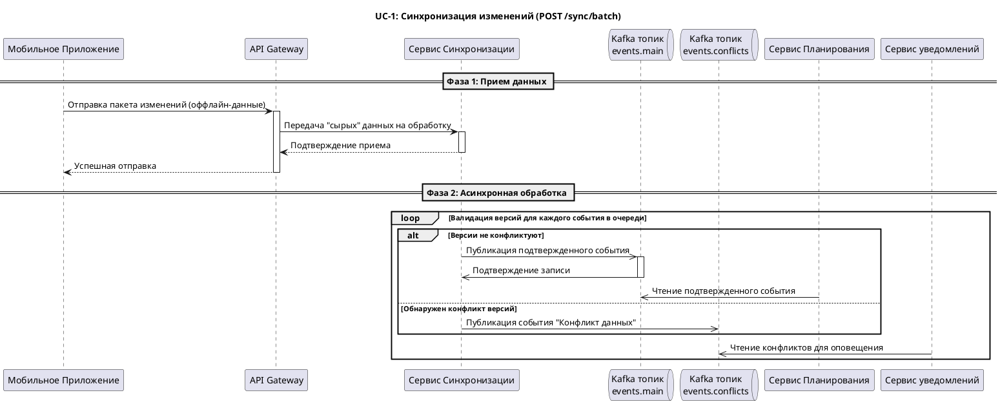

```plantuml
@startuml
title UC-1: Синхронизация изменений (POST /sync/batch)

participant "Мобильное Приложение" as App
participant "API Gateway" as GW
participant "Сервис Синхронизации" as Sync
queue "Kafka топик\nevents.main" as K_main
queue "Kafka топик\nevents.conflicts" as K_conflicts
participant "Сервис Планирования" as Trip
participant "Сервис уведомлений" as Push

== Фаза 1: Прием данных ==
App -> GW: Отправка пакета изменений (оффлайн-данные)
activate GW
GW -> Sync: Передача "сырых" данных на обработку
activate Sync

Sync --> GW: Подтверждение приема
deactivate Sync
GW --> App: Успешная отправка
deactivate GW

== Фаза 2: Асинхронная обработка ==
loop Валидация версий для каждого события в очереди
      alt Версии не конфликтуют
          Sync ->> K_main: Публикация подтвержденного события
          activate K_main
          Sync <<- K_main: Подтверждение записи
          deactivate K_main

              Trip ->> K_main: Чтение подтвержденного события
        else Обнаружен конфликт версий
            Sync ->> K_conflicts: Публикация события "Конфликт данных"
      end
    Push ->> K_conflicts: Чтение конфликтов для оповещения
end
@enduml
```
